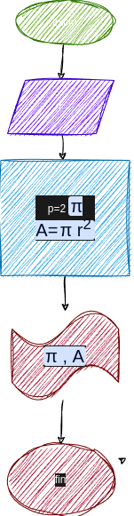

# programa #1
programa para carlcular el area y el perimetro de un circulo r

# analisis
  

## imput 
### variables de entrada 
r: radio del circulo 
### processing
p:perimetro de circulo
p= 2 πr   

area del circulo 
A= πrr  

### output
a,p
# diseño
 "diagrama de flujo"

# construccion